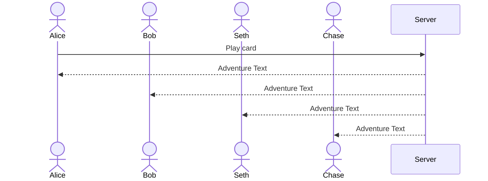

# Text Dungeon Showdown

The cold iron gate **SLAMS** down behind you. You've entered into... **Text Dungeon Showdown!**: the browser game where you and up to three friends write the story! Create the story of a brave hero facing traps and treasure in a dungeon. In this fun and strategic multiplayer experience, all of you must work together to drive the story forward, while at the same time competing in an epic battle to level up the hero in a way that will help you to win! Players must level up either the hero's ✨ Magic, 🦾 Strength, 📖 Intelligence or 💄 Charisma. But watch out! If you don't play your cards in the correct order, you might be foiled!

## 🚀 Specification Deliverable

For this deliverable I did the following. I checked the box `[x]` and added a description for things I completed.

- [x] Proper use of Markdown - I made use of headers, bold text, and images.
- [x] A concise and compelling elevator pitch - I gave reasons players might want to engage with this game.
- [x] Description of key features - I described the key features players might expect to interact with in the game.
- [x] Description of how you will use each technology - I used the strengths of each technology to create a list of what each technology would include
- [x] One or more rough sketches of your application. Images must be embedded in this file using Markdown image references. - I embedded a mockup of my project I created with NinjaMock using a Markdown image reference.

### Elevator pitch

If there's three things that make video games awesome, it's teamwork, competition, and monster-infested dungeons. So why can't a video game have all three? In **Text Dungeon Showdown!**, Players must work together to help a common hero brave a mysterious adventure, while simeotaneously influencing the path of the character in a way that will help you win. Filled to the brim with epic battles, strategic maneuvers and text adventure shenanigans, **Text Dungeon Showdown!** is the _perfect_ game for people to play, whether it be family and friends, or factions and foes. Settle it all... once and for all in: **Text Dungeon Showdown!**

### Design

Here is a sequence diagram showing how users might interact with the server to play **Text Dungeon Showdown**:

### Key features

- Secure login and account creation
- Persistent memory of game trophies
- Leaderboard with top player trophy counts
- Create game rooms and lobbies for users to interact
- Engaging and unique text story shared across all users
- Ability to perform actions which influence other users gameplay
- Ability to earn in-game trophies based on completing multiplayer games

### Technologies

I am going to use the required technologies in the following ways.

- **HTML** - I will use HTML to create a page for home, login, play, and leaderboard, with appropriate use of buttons, hyperlinks, images and HTML layout.
- **CSS** - visual CSS to make the game accessible on most device ratios and emphasize the most important parts of the application using bold fonts, colors, layout controls, and varying font sizes.
- **React** - Handling of login screen, display of game screen, other player screens, and drag/drop of cards for the game. Also for changing elements such as the indicator of the current player.
- **Service** - Call to server to get randomized possible player cards, adventure text related to cards and items, and icons of items. I am going to call to an external api to insert a random inspiriational quote into my game.
- **DB/Login** - Store user login information, along with the number of trophies they have earned. Then, stores a high score wall of all the trophies that players have earned.
- **WebSocket** - I will use websocket to keep track of player lobbies for games, current active games, data related to the game, cards of players, game inventories and progress.

## 🚀 AWS deliverable

For this deliverable I did the following. I checked the box `[x]` and added a description for things I completed.

- [x] **Server deployed and accessible with custom domain name** - [My server link](https://chaseodom.click).

## 🚀 HTML deliverable

For this deliverable I did the following. I checked the box `[x]` and added a description for things I completed.

- [x] **HTML pages** - I created HTML pages for the home/login, the game play screen, and the leaderboard screen.
- [x] **Proper HTML element usage** - I incorporated a wide array of HTML elements, from strucutral elements such as `main` and `header` to media elements such as `img` to input elements such as `input`
- [x] **Links** - I included links between all of my pages.
- [x] **Text** - I have text in my application.
- [x] **3rd party API placeholder** - I have a placeholder to an inspirational quotes API.
- [x] **Images** - I have placeholder images in my application.
- [x] **Login placeholder** - I have a login placeholder and I display the user's name.
- [x] **DB data placeholder** - The content of the text adventure adventure database placeholder is contained within the `play.html` file.
- [x] **WebSocket placeholder** - The text adventure adventure is a placeholder for real-time communication from the server with the contents of the adventure.

## 🚀 CSS deliverable

For this deliverable I did the following. I checked the box `[x]` and added a description for things I completed.

- [x] **Header, footer, and main content body** - I have headers, footers, and main content.
- [x] **Navigation elements** - I have navigation elements.
- [x] **Responsive to window resizing** - My application responds to resizing through flexBox.
- [x] **Application elements** - I included several application elements.
- [x] **Application text content** - My application includes various text content.
- [x] **Application images** - My application includes several images.

## 🚀 React part 1: Routing deliverable

For this deliverable I did the following. I checked the box `[x]` and added a description for things I completed.

- [x] **Bundled using Vite** - I bundled my application using Vite.
- [x] **Components** - I created React compontents.
- [x] **Router** - I used the React Router.

## 🚀 React part 2: Reactivity

For this deliverable I did the following. I checked the box `[x]` and added a description for things I completed.

- [x] **All functionality implemented or mocked out** - I have functionality mocked out and just need to implement the web server!
- [x] **Hooks** - I have several hooks, including useEffect and useState.

## 🚀 Service deliverable

For this deliverable I did the following. I checked the box `[x]` and added a description for things I completed.

- [x] **Node.js/Express HTTP service** - Node.js is successfully used as the backend of my deliverable.
- [x] **Static middleware for frontend** - I utilize static middleware for my front end by serving up the contents of the public folder.
- For the Startup Service deliverable please specify the file in which you wrote your Third Party Endpoint, thanks!
- [ ] **Calls to third party endpoints** - I did not complete this part of the deliverable.
- [x] **Backend service endpoints** - I use backend service endpoints using `/api/*`.
- [x] **Frontend calls service endpoints** - I
- [ ] **Supports registration, login, logout, and restricted endpoint** - I did not complete this part of the deliverable.

## 🚀 DB deliverable

For this deliverable I did the following. I checked the box `[x]` and added a description for things I completed.

- [ ] **Stores data in MongoDB** - I did not complete this part of the deliverable.
- [ ] **Stores credentials in MongoDB** - I did not complete this part of the deliverable.

## 🚀 WebSocket deliverable

For this deliverable I did the following. I checked the box `[x]` and added a description for things I completed.

- [ ] **Backend listens for WebSocket connection** - I did not complete this part of the deliverable.
- [ ] **Frontend makes WebSocket connection** - I did not complete this part of the deliverable.
- [ ] **Data sent over WebSocket connection** - I did not complete this part of the deliverable.
- [ ] **WebSocket data displayed** - I did not complete this part of the deliverable.
- [ ] **Application is fully functional** - I did not complete this part of the deliverable.
