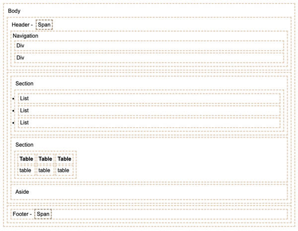
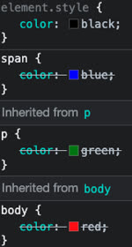
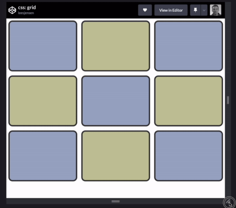
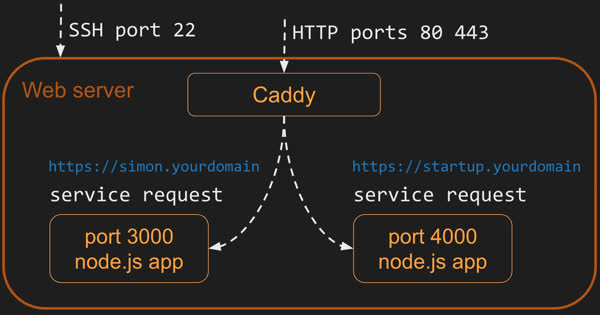

# CS 260 Notes

[My startup](https://simon.cs260.click)

## Helpful links

- [Course instruction](https://github.com/webprogramming260)
- [Canvas](https://byu.instructure.com)
- [MDN](https://developer.mozilla.org)
- [VIM Editor Controls](https://www.redhat.com/en/blog/introduction-vi-editor)
- [Burning Text](https://cooltext.com/Logo-Design-Burning)

## Brainstorming

Sign shop game from Cool Math Games, but its css buttons?
Multiple Solitare as an app? (perhaps a little complex)
choose your own adventure, but competitive! Goal: have most health at the end. You might have a "bob runs into a bear" tile, which is bad if you arent a bear,
but if you are a bear then you are unaffected, so you have to drink the bear potion first.

House building trading game. You have resources and have to trade with other players to try to build your house first, but you don't know what they have.
Filler game on websocket! Cool animations potentially? (see artmouse155 on Scratch - Filler)
Bomb simulator on a website! Each player has to help diffuse the bomb.

Storybook creator!
You basically play mad libs and create a story. Each option has a set of finite options. You play levels where you have to complete scenarios:
[Storyteller](<https://en.wikipedia.org/wiki/Storyteller_(video_game)>)

Multiplayer choose your own adventure!
BUT
you get to choose from three options what happens to a character in a given turn. This character has attributes:
health (damage), strength, magic, intelligence
Each player picks something to happen to the character. Each player wants to maximize a stat, and the highest stat wins

im not your neighbor game - spot the defects

Game where you put your tasks on tiles that are affected by gravity, and then you put them into boxes and drawers with fun animations and physics.

Well O' Quotes: A virtual well that you can spin the handle on and it pulls up a quote. You can throw another quote in the well to inspire someone else.

"Do or do not, there is no try". -Yoda _Sumbitted by user artmouse155_

OR it's an game where you can fish up random emojis?

LearnProPlusPremium: A website about learning new skills. You can upload

## Text Dungeon Showdown

Text Dungeon Showdown! You compete against other players to play a cooperative text adventure game.
-You have cards that have different effects:
Add MAGIC BAG to inventory
Use most recent item in inventory
Encounter a MAGIC POTION (+2✨)? <- The question mark means that the potion might increase magic unless something special happened.

"You approach an archway at the end of the room. Etched in stone above the door reads: (use inspirational quote API to insert a quote here)"

At the end of each encounter, you fight a final enemy whose health is 10 \* (num players). The damage dealth is every stat combined. This gives you an incentive to help other players so you don't all just lose. If you kill the boss, the player with the highest stat wins. If the boss kills you, you all lose.

There's gotta be a sort of randomness at the end so it isn't obvious who will win? Perhaps bosses have special abilities.

## Demo Game Text

> Eldrond had barely finished stepping both feet inside the dungeon when **WHAM!** the gate slammed down behind him.

> "This doesn't look like Kansas anymore!" exclaimed Eldrond.

> Eldrond looked around and found himself in a small musty room that was filled with bugs. He looked ahead and saw an archway, and inscripted above the arch were the following words:

> “It's easy to stand in the crowd but it takes courage to stand alone.” - Ghandi

> Feeling inspired, Eldron began his trek into the unknown.

**Alice's Turn**

> As Elrond walked, his foot suddenly hit something small and hard. He looked down and... it was a book titled "A Summary of Every Book Ever Written".

> "Gadzooks!" exclaimed Elrond. He sat on the floor and began to inspect its pages and before he knew it, he had read the whole thing!

> **+5 📖 Intelligence**

**Bob's Turn**

> Down a dark staircase, Elrond noticed a mysterious object glimmering in a hole in the rock on his left. Curious, He reached his hand in and pulled out...

> A luxirous top hat!

> Elrond tried the item on, noticed it was very fashionable, and satisfied, placed the clothing item back where he found it. Maybe his adventure was short-lived, but he felt that it somehow left a lasting mark on his appearance.

> **+300 💄 Intelligence**

**Seth's Turn**

> After several hours of walking (and a few minutes of skipping) Elrond came across a well that looked so old, it was as if it would crumble to dust if he touched it.

> He noticed the bucket was close to the surface of the well and so he took a look inside. He could see what was inside! It was...

> A mysterious potion of unknown consequence!

> Just barely able to reach it, Elrond grabbed the item and stuffed it into his inventory.

> **Mysterious Potion Obtained**

Exclamations:
Gadzooks!
Great Scott!
Nuggets!
Great Googly Moogly!
I'll be a monkey's uncle!
Jinkies!
Zoinks!
Holy Guacamole!
WHAT???!?!?!?

Books:
A Summary of Every Book Ever Written
101 BYU Student Vacation Ideas (And why the MARB is the best one)
So You're Stuck in a Text Adventure
Platonic Liquids and Other Things Your Math Teachers Don't Tell You About
The Book of Time

> [!NOTE]
> This is a template for your startup application. You must modify this `README.md` file for each phase of your development. You only need to fill in the section for each deliverable when that deliverable is submitted in Canvas. Without completing the section for a deliverable, the TA will not know what to look for when grading your submission. Feel free to add additional information to each deliverable description, but make sure you at least have the list of rubric items and a description of what you did for each item.

> [!NOTE]
> If you are not familiar with Markdown then you should review the [documentation](https://docs.github.com/en/get-started/writing-on-github/getting-started-with-writing-and-formatting-on-github/basic-writing-and-formatting-syntax) before continuing.

> [!NOTE]
> Fill in this sections as the submission artifact for this deliverable. You can refer to this [example](https://github.com/webprogramming260/startup-example/blob/main/README.md) for inspiration.

Dad jokes API

https://icanhazdadjoke.com

[My Notes](notes.md)

## Github Notes

I learned that Github can be used to store cloud repositories. I learned how to use commands such as "clone", "fetch", "push" and "pull" to make use of my repository.
clone - pull and create repo
fetch - get info about repo without actually pulling
push - push commit
pull - get

## AWS Notes

I learned how to create an AWS server instance, how to register a domain name, and how to link the two together.

I can access the console via secure shell (ssh) using this command:

```
➜  ssh -i [key pair file] ubuntu@[ip address]
```

My domain is [chaseodom.click](http://chaseodom.click)

## Caddy

Caddy is a web service that allows us to expose all of our web services as a single web service
-allows us to easily support https

## HTTP vs HTTPS

Hypertext Transport Protocol (HTTP)
Secure Hypertext Transport Protocol (HTTPS) - requires a "negotiated secure connection" before data is exchanged

# HTML Notes

HTML adds structure _and_ content to a web application

### HTML Struture

- `body`
- `header`
- `footer`
- `main` - main content
- `section`
- `aside`
- `p`aragraphs
- `table`
- `ol/ul` ordered / unordered list element
- `div`isions
- `span` - can be used to mark a person's name for example



You can have multiple classes assigned to the same element using spaces:

```html
<div class="box box1"></div>
```

### HTML Input

- `form` | input container
  `<form action="form.html method="post">`
- `fieldset` labeled input grouping (use like div)
- `input` | Multiple types of user input | `<input type="" />`
- `select` | Selection dropdown:
  `<select><option>1</option></select>`
- `optgroup` Grouped selection drowpdown
  `<optgroup><option>1</option><optgroup/>`
- `option` Selection Option | `<option selected>option2</option>`
- `textarea` multiline text input
  `<textarea></textarea>`
- `label` Individual input label
  `<label for="range">Range: </label>`
- `output` Output of input
  `output for="range">0</output>`
- `meter` Display value with a known range
  `<meter min = "0" max = "100" value = "50"></meter>`

The input element is very versatile! Types of inputs include:

```bash
text
password
email
tel //telephone
url //url address
number
checkbox //inclusive selection
radio //exclusive selection
range //range limited number
date //year, month, day
datetime-local //date and time
month //year, month
week //week of year
color //color
file //local file
submit //button to trigger form submission
```

Here is an example of a checked radio button from the lectures:

```html
<label for="checkbox1">Check me</label>
<input type="checkbox" name="varCheckbox" value="checkbox1" checked />
```

Common attributes include:

- `name` : name of the input. Submitted as the name of an input if the input is used in a form
- `disabled` : disables user interactivity
- `value` : initial value of the input
- `required` : This attribute means a value is required for the form to be valid

### Validating HTML input

There is a `pattern` attribute that can validate input using regular expressions, meaning it won't be accepted if it doesn't follow the regex

- Available on `text, search, url, tel, email, and password`

> [!NOTE]
> Good design gives users feedback early on about data vaildation.

To make a checkbox (`<label type="checkbox">`) already checked, add the `checked` attribute.

### HTML media elements

Five main ones: `img`, `audio`, `video`, `svg`, and `canvas`.
`svg` and `canvas` are editable

#### Images

`img` elements contain `alt`ernate text and a `src` (source)

EXAMPLE:

```html

```


#### Audio

`audio` elements can have the `controls` attribute to let users control audio. Like images, they have a `src`. `loop` will loop, and `autoplay` (discouraged) will play the audio right when it is loaded.

#### Video

`video` elements are similar to `audio` elements in that they have `src`, `loop`, `autoplay` and `controls` tags. They also have a `width` tag.

Sometimes when you request an external video, you need `crossorigin="anonymous"`

#### Scalable Vector Graphic (SVG)

Scalable vector graphics renders graphics inline with HTML.

Example:

```html
<svg
  viewBox="0 0 300 200"
  xmlns="http://www.w3.org/2000/svg"
  stroke="red"
  fill="red"
  style="border: 1px solid #000000"
>
  <circle cx="150" cy="100" r="50" />
</svg>
```

which renders this:

<svg viewBox="0 0 300 200" xmlns="http://www.w3.org/2000/svg" stroke="red" fill="red" style="border: 1px solid #000000">
  <circle cx="150" cy="100" r="50" />
</svg>

## Simon HTML

We always want to call our top level page index.html

> A submit button inside of a form element will cause the action to happen

## Deployment

Before adding any services, we can just use `deployFiles.sh` and run it like so:

```bash
./deployFiles.sh -k <yourpemkey> -h <yourdomain> -s simon
```

We can add `class` attributes to `div` elements

Deployment successful as of 5:27 PM 1/24/25
To access my pemkey, i can do `./../../CreameryBrownie.pem`

### Extra HTML tidbits

Set a standard viewport size:
`<meta name="viewport" content="width=device-width, initial-scale=1.0" />`
Add a wepage title:
`<title>Simon HTML</title>`
Add a webpage icon:
`<link rel="icon" href="favicon.ico" />`

Using `<menu>` instead of `ul` when users are interacting with it!

Startup Deployment successful as of 7:17 PM 1/24/25

# CSS Notes

CSS is made up of many defining rulesets / `rules`.
`property` corresponds to a `value`; whole thing is called a `declaration`.


- The **DOM Tree** represents the Document Object Model, or the heiarchy of data
- The way in which CSS takes priority is according to the DOM; Lower levels will override higher levels




Example CSS:

```css
body {
  color: red;
}

header {
  color: blue;
}

footer {
  color: green;
}
```

## Selectors

You can do multiple like this:

```css
td,
th {
  border: solid 1px black;
}
```

### Combinators

When we want CSS to apply to a specific combination of elements; for example, all `h2`s which are descendants of `section`s

```css
section h2 {
  color: blue;
}
```

| Combinator       | Meaning                    | Example        | Description                                |
| ---------------- | -------------------------- | -------------- | ------------------------------------------ |
| Descendant       | A list of descendants      | `body section` | Any section that is a descendant of a body |
| Child            | A list of direct children  | `section > p`  | Any p that is a direct child of a section  |
| General sibling  | A list of siblings         | `div ~ p`      | Any p that has a div sibling               |
| Adjacent sibling | A list of adjacent sibling | `div + p`      | Any p that has an adjacent div sibling     |

### Class Selectors

Do class selectors with a dot.
HTML:

```html
<p class="introduction">Introduction</p>
```

CSS:

```css
.summary {
  font-weight: bold;
}
```

We can also combine it with the element tag to select all paragraphs with a class summary.

```css
p.summary {
  font-weight: bold;
}
```

### Attribute Selectors

We can also create CSS code on the basis of attribute selectors, which can select all sorts of attributes.

```css
[href="https://example.org"]
{
  color: blue;
}
```

## Pseudo Selectors

```css
section:hover {
  border-left: solid 1em purple;
}
```

## SVG Paths

#### Paths - For moving HTML elements

https://developer.mozilla.org/en-US/docs/Web/SVG/Tutorial/Paths

Five line commands
| Command | Meaning | Example | Description |
| ------- | ------- | ------- | ----------- |
| `M` | Move (x y) | `M 10 20` or `m dx dy` | The first command. Move to an X and Y position. |
| `L` | Line (new x, new y) | `L 5 15` or `l dx dy` | Draw a line from the current position. |
| `H` | Horizontal line (x) | `H 20` or `h dx` | Draw a horizontal line. |
| `V` | Vertical line (v) | `V 20` or `v dy` |

All commands come in _two variants_.

- An **uppercase letter** means absolute coordinates
- A **lowercase letter** means relative coordinates

##### Curves!

You can also make cubic and quatradic bezier curves! You do this with `C / c` and `Q / q`
You can make shorthand bezier curves with `S / s` and arcs with `A`.

- These create ellipses!

## Animation

I couldn't get my CSS animation to work! I fixed it by making it "animation-duration" instead of "animaition-duration".

### Elements of a CSS Animation

Animations need to have a name and a duration. Here is an example:

```css
p {
  animation-name: grow;
  animation-duration: 5s;
}

@keyframes grow {
  from {
    font-size: 20px;
  }
  90% {
    font-size: 45px;
  }
  to {
    font-size: 40px;
  }
}
```

We use `animation-name`, `animation-duration`, and `@keyframes`.

https://developer.mozilla.org/en-US/docs/Web/CSS/CSS_animations/Using_CSS_animations

Really cool slide in effect from aboe:

```css
@keyframes slide-in {
  from {
    translate: 150vw 0;
    scale: 200% 1;
  }

  to {
    translate: 0 0;
    scale: 100% 1;
  }
}
```

You can use `animation-fill-mode: forwards;` to make an animation "stick".

You can change the easing using easing such as "ease-out"

You can transform using

```css
p {
  transform: translateX(0%);
}
```

## Responsive Design

How we reconfigure for multiple devices!
The `display` property is powerful at changing how elements are organized on a screen.

This line of code tells the phone not to scale a page on mobile:

Example Code

```css
.none {
  display: none;
}

.block {
  display: block;
}

.inline {
  display: inline;
}

.flex {
  display: flex;
  flex-direction: row;
}

.grid {
  display: grid;
  grid-template-columns: 1fr 1fr;
}
```


```html
<meta name="viewport" content="width=device-width,initial-scale=1" />
```

A `float` css property allows for content which is `inline` to wrap around it; Ex. image surrounded by text

We can run certain code based on whether or not we are in portrait mode or landscape mode.

```css
@media (orientation: portrait) {
  aside {
    display: none;
  }
}
```

## CSS Grid

Grid items can be in a freeform grid with the CSS grid display property: `display: grid;`
Here is an example:

```css
.container {
  display: grid;
  grid-template-columns: repeat(auto-fill, minmax(300px, 1fr));
  grid-auto-rows: 300px;
  grid-gap: 1em;
}
```

TEST

```diff
+ I like green
eh
- I like red
```



## Flexbox


# React Part 1 Notes

## Javascript

Javascript is a pretty awesome language!

- most used in the world
- weakly typed language
- runs on any browser

We can print to output with `console.log()`

javascript example:

```js
function join(a, b) {
  return a + b;
}

console.log(join("Hello", "World!"));
```

Comments:

```js
// Line comment

/*
Block comment
*/
```

### Javascript in HTML

We can plug Javascript into HTML by

1. importing the script using `<script></script>` and
2. using the `onclick` attribute for an element.

We can include the following javascript in `index.js:`

```js
function sayHello() {
  alert("Hello");
}
```

...and then include it and run it.

```html
<!-- external script -->
<head>
  <script src="index.js"></script>
</head>
<body>
  <button onclick="sayHello()">Say Hello</button>
  <button onclick="sayGoodbye()">Say Goodbye</button>

  <!-- internal script block -->
  <script>
    function sayGoodbye() {
      alert("Goodbye");
    }
  </script>

  <!-- inline attribute handler -->
  <script>
    let i = 1;
  </script>
  <button onclick="alert(`i = ${i++}`)">counter</button>
</body>
```

### Node.js

Node.js is typically just called Node. It is an application that lets you run javascript outside of the browser!
Both Node.js and Google use the V8 engine.

We can excute Node.js by running the `node` command in the terminal.
Check version: `node -v`
Run one line: `node -e "console.log(1+1)"`
Run interpretive mode: `node`
Run a file: `node index.js`

#### Loading Node packages

Node Package Manager (NPM) is a program that

- can access a wide library of packages on the internet
- manages libraries for your JS projects

To create an empty npm folder run:

```bash
npm init -yes
```

The `-yes` is optional, but allows you to set all the default settings

#### Routing

Routing elements are controlled by `BrowserRouter`

```jsx
    <BrowserRouter>
      <!-- The previous component elements go here -->
    </BrowserRouter>
```

Going between links to different pages:

```jsx
<a className="nav-link" href="play.html">Play</a>

// to

<NavLink className='nav-link' to='play'>Play</NavLink>
```

Routed component:

```jsx
 <main>App components go here</main>

 // to

<Routes>
  <Route path='/' element={<Login />} exact />
  <Route path='/play' element={<Play />} />
  <Route path='/scores' element={<Scores />} />
  <Route path='/about' element={<About />} />
  <Route path='*' element={<NotFound />} />
</Routes>
```

11:55 PM: Simon and Startup both have been deployed!

# React Part 2 Notes

## Basic Console

We can write a message to write to console using `console.log.`

```js
console.log(`Hello World`);
```

And the style can even be changed!

```js
console.log("%c Yeet", "color: blue"); //Prints "Yeet" in blue
```

We can use **time** and **timeEnd** to look at time.

```js
console.time("demo");
for (let i = 0; i < 1000000; i++)\
{
  // Do something
}
console.timeEnd('demo'); // Prints 'demo: 12.74 ms'
```

We can also use `console.count(a)`, which prints how many times `count` with that specific parameter was called.s

## Functions

- Functions can be defined inside of other functions.
- Functions can also be assigned to variables.
- Functions can also have a default value.

Here's an example of a regular function and an inline function.

```js
// Standard:
function add(a, b) {
  return a + b;
}

const add_func = function (a, b) {
  // Note we can make it const
  return a + b;
};
```

## Arrow functions

Functions are **first class functions**
Arrows (`=>`) are another way we can define functions.

- curly braces are optional!
- `return` statements are optional

Examples:

```js
() => 3; // Function that returns 3

() => {
  3; // Returns 3
};

() => {
  return 3; // Also returns 3!
};
```

Arrow functions inherit the `this` pointer, creating something called `closure.`

```js
function make_closure(init_val) {
  let closure_val = init_val;
  return () => {
    return `closure${++closure_val}`;
  };
}

const closure = make_closure(0);

console.log(closure()); // Return 1 (incremented before returning)

console.log(closure()); // Return 2
```

Allows for the use of "shared" variables across function calls!

## Objects and Classes

Javascript objects are made up of name-value pairs.

- property name is a `String` or `Symbol`, but value is any type.
  - Only `Strings` can go inside the square brackets(`[]`), and only non-strings can be the acess modifiers.
    - This lets you mix and match, but only if the property is named in a way that lets you do so.
      Examples:

```js
obj = new Object({ name: "bob", age: 3 });
obj.name; // returns the name "bob"
obj["age"]; // returns 3
```

NOTE: Javascript `Objects` are `objects`, but they are different.
The `object-literal` syntax allows you to create a variable of `object` type. this is done with standard curly braces.

### Objects

#### Useful functions for the Object object

- **entries** : Returns an array of key value pairs
- **keys** : Returns an array of keys
- **values** : Returns an array of values

NOTE: These will convert any tokens into `Strings`.

#### The `this` pointer

In the context of an object, `this` refers to the object itself.

#### Constructors

Any function returning an `object` can be called a `constructor`. These can be invoked with the `new` operator.

- Also, one of the attributes can just be a method, allowing objects to have methods!

### Classes

Classes can define objects! We use the `class` keyword to create a **reusable component**.
Example:

```js
class MyClass {
  name = "bob";
  constructor(_name = name) {
    this.name = name;
  }

  log() {
    console.log("yeet!");
  }
}
```

- Don't forget the `this` keyword!
- Make properties or functions private by prefixing with #.

#### Inheritance

Classes can extend other classes to inherit. The parent constructor can be called using the `super` function.

- Child functions with the same name override the parent's function

```js
class Employee extends Person {
  constructor(name, position) {
    this.position = position;
    super(name);
  }

  print() {
    console.log(super.print() + ". I am a " + this.position);
  }
}
```

## Destructuring

We can destructure to "pull" data out of arrays or objects.
Example:

```js
const arr = [1, 2, 3, 4, 5, 6];

const [a, b] = arr;

console.log(a, b); // prints 1 2
const [c, d, ...others] = arr; // rest syntax

console.log(c, d, others); // prints 1 2 [3,4,5,6]
```

When we destructure with objects, we **specify** which properties we want to pull out.

- We can rename properties, or even provide defaults if ones aren't found!

```js
const book = { title: "Book o' Bob", author: "Joe", reviews: [5, 5, 4] };

const { title, author } = book; // Pulls out title and author vars.
console.log(title, author); // prints Book o' Bob Joe

const { title: t, author: a } = book; // Does same as above, but new var names!
console.log(t, a); // prints Book o' Bob Joe

// We can even provide default values. Not found items are undefined.
const { reviews: r, color: c, publish_year: p = "1996" } = book; // Does same as above, but new var names!
console.log(r, c, p); // prints [5, 5, 4] undefined 1996
```

We use destructuring in React to "pull out" parameters that we need, which are passed into our component as an object using `React.use_state()`.

```jsx
function Clicker({ initialCount }) {
  const [count, updateCount] = React.useState(initialCount);
  return <div onClick={() => updateCount(count + 1)}>Click count: {count}</div>;
}

const root = ReactDOM.createRoot(document.getElementById("root"));
root.render(<Clicker initialCount={3} />);
```

## Timeout and interval

We can delay something happening with the `setTimeout` function.
It takes in a funciton and a time to wait (in miliseconds):

```js
setTimeout(() => console.log("3 seconds later!"), 3000); // Code continues to execute after, so following statement is actually first
console.log("This will run first, though.");
```

`setInterval` is similar, but will **repeatedly** call the function with the given interval.

- We can `clearInterval` to stop this interval nonsense.

```js
const interval = setInterval(() => console.log("I run every second!"), 1000);
setTimeout(() => clearInterval(interval), 5000); // After 5 seconds, we stop running the interval. Thus, the interval only runs 5 times.
```

## Hooks

Hooks give functionality to React style components. Here are a few.

### `useEffect`

The `useEffect` hook allows you to pass a function that runs when a component completes rendering.

```jsx
function UseEffectHookDemo() {
  React.useEffect(() => {
    console.log("rendered");
  });

  return <div>useEffectExample</div>;
}

const root = ReactDOM.createRoot(document.getElementById("root"));
root.render(<UseEffectHookDemo />);
```

You can pass in an additional parameter of an array of dependencies.

### `useState`

`useState` always returns an array with two values:

- the current state, which matches `initialState` (What you pass into `useState`)
- the `set` function which will update the state.
  - This triggers a re-render, which makes `useState` useful!
  - WARNING! This will trigger an updated state for the next-re-render. So, you have to be careful with reading the variable after the set function because it very well might not be updated yet!
  - If the value is identical, react won't re-render component and children.

# Express

## More HTML

POST is update, PUT is create.
We can leverage HTTP and the idea of nouns with the verbs in the HTTP request to help make sense for the user.

## Express functions

```js
const app = express();

app.get("/store/:id/:time", (req, res) => {
  res.send(`${(store, req.params.id, req.params.time)}`);
});
```

We can use the `app.use(express.json())` middleware to parse `json` strings into javascript or html objects!

# HTTP Service

## Web Servers

What is a web server?

- A web server is a _computing device_ that is hosting a _web service_ that knows how to accept incoming internet connections and speak the HTTP application _protocol._\

- A web server is either a physical or abstract computer that controls a web service, and can let internet connections talk to it using a protocol that everyone knows.

My application is also a web service!

- My application can load up HTML content from a public directory.

Example

```js
const express = require("express");
const app = express();

// Serve static files from the 'public' directory
app.use(express.static("public"));

app.listen(80);
```

### Web service endpoints

Well, since my application can be a web service, I can add web accessible methods, which are called _endpoints._ They can do things other than giving static HTML files!

If I want to make it so that when I append `/burger` to my URL that it tells me the current time, I can do this:

```js
app.get("/time", (req, res) => {
  res.json({ time: new Date().toDateString() });
});
```

A _web server_ is a physical device that typically hosts a _web service_.

**Microservices** are web services that serve a single functional purpose.

### URL

After the path of the URL is the parameters, which are a **list of key value pairs**.

- can refer to how to higlight the resource
- also called the query string

### Ports

When we request data or use protocols, we do so on **ports.**

#### Common ports

- Port 22: Secure shell for remote devices
- Port 80: HTTP for web requests
- Port 443: HTTPS for secure web requests

When I access my website, SSH (port 22) goes to my Web Server, while 80 and 443 both go to Caddy.

- 80 redirects to 443
- Caddy also manages requests to ports

> IMPORTANT!
> We can only host each service on a different port



### Fetch API

The fetch API can make web service requests.

Example code:

1. First, we make the request.
2. We check the response promise for a response
3. We convert the json to an object

```js
fetch("https://quote.cs260.click")
  .then((response) => response.json())
  .then((jsonResponse) => {
    console.log(jsonResponse);
  });
```

By default, the request is a `GET` request, but we can specify a `POST` request.

```js
fetch("https://jsonplaceholder.typicode.com/posts", {
  method: "POST",
  body: JSON.stringify({
    title: "test title",
    body: "test body",
    userId: 1,
  }),
  headers: {
    "Content-type": "application/json; charset=UTF-8",
  },
})
  .then((response) => response.json())
  .then((jsonResponse) => {
    console.log(jsonResponse);
  });
```

### Service Design

**There are 4 main verbs in HTTP/HTTPS requests.**

- GET
  - List the comments
- POST
  - Create a new comment
- PUT
  - Update a comment
- DELETE
  - Delete a comment

A `replication server` makes my code redundant to attacks.

#### Endpoints

Main points of endpoints!

- `Grammatical` : Every resource in http is a noun, and actions are verbs
  - order resource stored in a store resource
- `Readable` : Make the endpoint human readable so it is easier to remember what it does!
  - For example: `/store/provo/order/32029`
- `Discoverable` : Endpoints should have information about their subendpoints in them.
  - Example:

```bash
GET /store/provo  HTTP/2
```

returns:

```js
{
  "id": "provo",
  "address": "Cougar blvd",
  "orders": "https://cs260.click/store/provo/orders",
  "employees": "https://cs260.click/store/provo/employees"
}
```

- `Compatible` : New funcionality won't break old endpoints. For instance:

```js
{
  "color" : "#ff0010"
}
// This becomes...
{
  "color" : "#ff0010",
  "red" : 255,
  "green" : 0,
  "blue" : 16
}
// This ensures that old functionality is still intact!
```

You can find out about specification about API's here: https://spec.openapis.org/oas/latest.html or here: https://petstore.swagger.io/

###### Using `POST` and `RPC`

We can use post as a function call in two ways. One is that we call the function directly after `POST`, and then the body of our parameters.

```bash
POST /updateOrder HTTP/2

{"id": 2197, "date": "20220505"}
```

We can also do a call to the RPC (Remote Procedure Call) function itself.

```bash
POST /rpc HTTP/2

{"cmd":"updateOrder", "params":{"id": 2197, "date": "20220505"}}
```

REST = resource
A `GraphQL` query tries to define how data should be used.

### Express (AGAIN!)

> "People tell you to not reinvent things, but I think you should … it will teach you things"
>
> — TJ Holowaychuk
> What is express?

- It is a javascript module that is REALLY GOOD at serving up webpages. It has some great usefulness! It can...

1. Do routing requests for service endpoints
2. Manipulating HTTP requests with JSON body content
3. Generating HTTP responses
4. Using `middleware` to add functionality

- what is middleware?

First we install express with `npm install express`. Then we use it with

```js
const express = require("express");
const app = express();

app.listen(8080); // Listen on port 8080

app.get("/store/provo", (req, res, next) => {
  res.send({ name: "provo" });
});
```

- `req` represents the request object from the client to the server
- `res` represents the response object from the server to the client
- `next` is a routing function that express expects to be called if the routing function wants another function to generate a response.

Q. But what if I want to see what the user put into the parameter?
A. Well, all you gotta do is use **parameters!** You do that with colons: `:`. All you gotta do is this:

```js
app.get("/store/:storeName", (req, res, next) => {
  // the colon makes storeName a param of the request object.
  res.send({ name: req.params.storeName });
});
```

We can also use _wildcards_ and _pure regular expressions!_

```js
// Wildcard - matches /store/x and /star/y
app.put("/st*/:storeName", (req, res) =>
  res.send({ update: req.params.storeName })
);

// Pure regular expression
app.delete(/\/store\/(.+)/, (req, res) => res.send({ delete: req.params[0] }));
```

#### Middleware

Middleware is super cool! It is a way to handle requests before finally sending the response.

- They follow this format:

```js
function middlewareName(req, res, next)
```

##### Making my own middleware

We can add one piece of middleware using `app.use`:

```js
app.use((req, res, next) => {
  console.log(req.originalUrl);
  next();
});
```

##### There is also built in middleware!

The built in `public` function will return static files if they exist in the directory.

```js
app.use(express.static("public"));
```

We can use a built in cookie parse that makes cookies super duper easy!

```js
const cookieParser = require("cookie-parser");

app.use(cookieParser());

app.post("/cookie/:name/:value", (req, res, next) => {
  res.cookie(req.params.name, req.params.value);
  res.send({ cookie: `${req.params.name}:${req.params.value}` });
});

app.get("/cookie", (req, res, next) => {
  res.send({ cookie: req.cookies });
});
```
